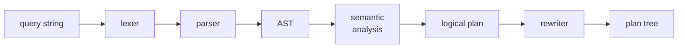

<div align="center">

# `cypher-rs`

### openCypher front-end in Rust

**Lex. Parse. Validate. Plan. Storage-agnostic.**

[](./LICENSE)
[](#roadmap)
[](#install)

</div>

A standalone openCypher front-end: lexer, parser, AST, semantic analyzer,
and logical plan generator. No storage, no executor, no opinion about
graph layout. Drop it into any Rust graph-DB-shaped project that needs
Cypher input without taking on `libcypher-parser` as a C dependency.

> **The thesis.** Every embedded graph DB ends up reimplementing the
> same Cypher front-end badly. The parser and the planner are separable
> from storage and execution — there's no good reason for each graph
> store to ship its own. This crate is the front-end, alone, done well,
> no batteries.

---

## ✦ Scope

| Stage | What | Status |
|---|---|---|
| Lexer | tokens for openCypher 9 grammar | planned |
| Parser | concrete syntax tree | planned |
| AST lowering | symbol table, variable binding | planned |
| Semantic analysis | type/scope/label/rel-type checks | planned |
| Logical plan | algebra: scan · expand · filter · project · agg | planned |
| Plan rewriter | predicate pushdown, projection pruning | planned |
| Cost model | pluggable; default = cardinality-only | planned |

Not in scope: physical plan, storage adapter, executor.

## ✦ Usage

```rust
use cypher_rs::{parse, plan};

let q = "MATCH (u:User)-[:FOLLOWS]->(f) WHERE u.id = $uid RETURN f.name";
let ast = parse(q)?;
let plan = plan(&ast, &schema)?;
println!("{plan:#}");
```

## ✦ Why standalone

- No `libcypher-parser` C dep — pure Rust, builds anywhere.
- No executor coupling — plug into Sled, RocksDB, FFS, in-memory, anything.
- Front-end is reusable across embedded, server, and analytics graph DBs.

## ✦ How



## ✦ Roadmap

- [ ] v0.1 — lexer + parser; MATCH / RETURN / WHERE / CREATE / MERGE
- [ ] v0.2 — semantic analyzer, schema-aware validation
- [ ] v0.3 — logical plan + algebra
- [ ] v0.4 — predicate pushdown, projection pruning
- [ ] v0.5 — cost-model trait + default impl
- [ ] v1.0 — openCypher TCK conformance ≥ 95%; used in FFS

## ✦ License

MIT — see [LICENSE](./LICENSE).
